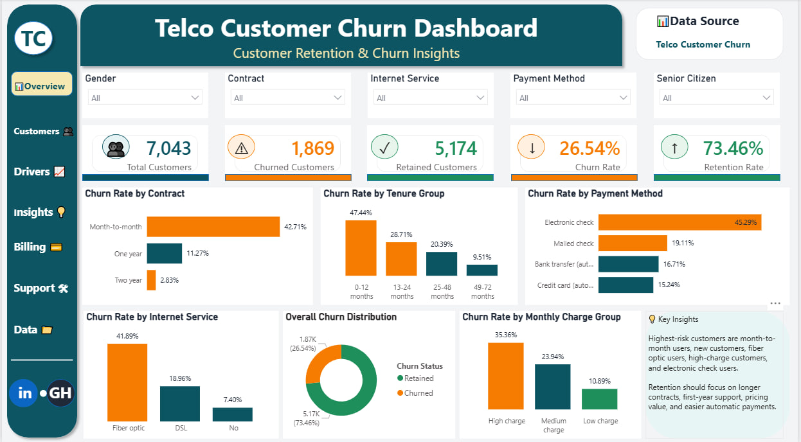

# Telco Customer Churn Analysis

## Project Overview

This project is a business analytics case study focused on customer churn in a telecom company. The goal of the analysis is to understand why customers are leaving and identify the key factors contributing to churn.

The analysis was carried out using Python for data cleaning and exploratory analysis, and Power BI for dashboard visualization and business storytelling.

## Business Problem

Customer churn is a major challenge for telecom companies because it leads to revenue loss and increases the cost of acquiring new customers.

This project aims to answer the question:

**Why are customers leaving the telecom company, and what actions can the business take to reduce churn?**

## Dataset Overview

The dataset contains customer-level information, including demographics, services subscribed to, contract type, payment method, tenure, monthly charges, total charges, and churn status.

### Dataset Summary

- Total customers analyzed: 7,043
- Total columns: 21
- Churned customers: 1,869
- Retained customers: 5,174
- Overall churn rate: 26.54%

## Tools Used

- Python
- Pandas
- Power BI
- PowerPoint / Canva
- GitHub

## Data Cleaning Process

The dataset was inspected for missing values, duplicates, and incorrect data types.

The `TotalCharges` column was originally stored as text because some records contained blank values. These blank values were linked to customers with zero tenure, so they were replaced with 0 and the column was converted to a numeric data type.

Additional columns were created to support the analysis:

- `ChurnFlag`
- `TenureGroup`
- `MonthlyChargeGroup`
- `Churn Status`

## Key Findings

- Overall churn rate was 26.54%.
- Month-to-month customers had the highest churn rate by contract type at 42.71%.
- Customers within 0–12 months of tenure had the highest tenure-based churn rate at 47.44%.
- High monthly charge customers had a churn rate of 35.36%.
- Fiber optic users had the highest churn rate by internet service at 41.89%.
- Electronic check users had the highest churn rate by payment method at 45.29%.

## Business Insights

The analysis shows that churn is higher among customers who are less committed, newer to the company, or paying higher monthly charges.

Month-to-month customers are more likely to leave because they are not tied to long-term contracts. New customers are also at high risk, showing that the first year is very important for customer retention.

High-charge and fiber optic customers may be more likely to leave due to pricing concerns, service expectations, or perceived value. Electronic check customers also showed higher churn, while automatic payment users were more stable.

## Recommendations

To reduce churn, the company should:

1. Encourage month-to-month customers to move to longer-term contracts.
2. Strengthen first-year customer retention through onboarding and regular check-ins.
3. Review pricing and improve value for high-paying customers.
4. Improve support and customer experience for fiber optic users.
5. Encourage customers to switch to automatic payment methods.

## Conclusion

Customer churn is mainly driven by contract type, tenure, monthly charges, internet service type, and payment method.

By focusing on high-risk customer groups, the company can reduce churn, protect revenue, and improve long-term customer loyalty.

## Project Files

- `data/` — cleaned dataset
- `dashboard/` — Power BI dashboard and dashboard image
- `report/` — business analytics case study report
- `presentation/` — project presentation
- `notebook/` — Python analysis notebook
